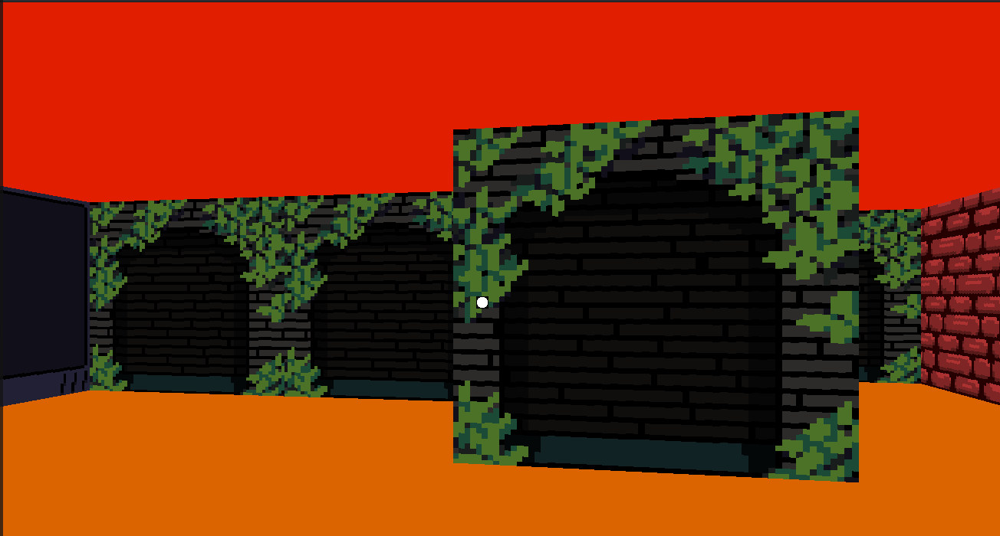

<p align="center">
  
</p>

<h1 align="center">
  <a href="https://github.com/fernandoruanb/cub3d">
    
  </a>
  <br>
  Cub3D
  <br>
</h1>

<h4 align="center">
  A raycasting project built in <a href="https://www.c-language.org/" target="_blank">C</a>, inspired by Wolfenstein 3D, focused on DDA, textures, map validation, and the illusion of 3D inside a 2D world.
</h4>

<p align="center">
  
  
  
  
</p>

<p align="center">
  <a href="#about-the-project">About</a> •
  <a href="#core-idea">Core Idea</a> •
  <a href="#map-validation">Map Validation</a> •
  <a href="#how-dda-works">How DDA Works</a> •
  <a href="#textures-colors-and-rendering">Textures, Colors & Rendering</a> •
  <a href="#possible-problems-and-bug-prevention">Bug Prevention</a> •
  <a href="#testing-philosophy">Testing Philosophy</a> •
  <a href="#how-to-use">How To Use</a> •
  <a href="#team">Team</a>
</p>

---

## About the Project

<html>
<p align="center">

</p>
<p align="center">
        <sub>Wolfstein example gif</sub>
</p>
</html>

**Cub3D** is a major step forward in graphics programming.

While the map itself still exists in **2D**, the project creates the **illusion of a 3D world** by using **raycasting**.  
That means the player is not walking inside a real 3D environment with true volumetric geometry, but inside a 2D map that is rendered in a way that visually simulates depth.

This is exactly what makes the project so interesting.

Inspired by the classic **Wolfenstein 3D**, the project introduces the idea that by casting rays, measuring distances, and projecting wall slices on screen, we can make a flat map feel like a real first-person world.

At the center of this illusion is the **DDA algorithm**, which allows the engine to move through the map grid efficiently and discover exactly where each ray collides with a wall.

More than just drawing walls, **Cub3D** becomes a project about:

- graphics programming
- heavy validation
- movement logic
- collision handling
- texture projection
- color parsing
- player orientation
- performance and visual stability

---

## Core Idea

The core idea of **Cub3D** is simple in theory:

- the world is a **2D map**
- the player has a **position** and a **direction**
- the engine casts rays forward across the screen
- each ray finds the distance to the nearest wall
- walls are drawn taller or shorter depending on that distance

That difference in wall height is what creates the sensation of **depth**.

So even though the map is not 3D, the player experiences it as if walking inside a three-dimensional maze.

This is why raycasting is such a beautiful concept:
it transforms a flat world into a first-person visual simulation.

---

<html>
	
</html>
## Map Validation

One of the first lessons that becomes obvious in a game project is this:

**a single validation failure can create a visible anomaly**.

And because of that, **Cub3D** requires a large amount of careful validation before the engine can even begin rendering.

The map may have:

- irregular shapes
- separated areas
- isolated islands
- diagonal structures
- open spaces that look harmless but actually break the game

That means validation cannot be superficial.

### Player validation

The player must appear correctly depending on the spawn marker present in the map.

The orientation can be:

- `N` for North
- `S` for South
- `W` for West
- `E` for East

Depending on which marker exists, the player must spawn at the right position and already be facing the correct initial direction.

### Structural validation

Much like **so_long**, the accessible play area must be fully protected.

It must never be possible for the player to reach a position that escapes the valid boundaries of the map.

So every accessible floor area must be checked carefully.

The player must also be prevented from spawning or moving into invalid regions such as:

- internal spaces
- tabs
- malformed gaps
- undefined cells

This becomes especially important in irregular maps, because a map does not need to be a perfect rectangle to be valid, but it must still be **closed where it matters**.

### File validation

The map file must also be validated by extension.

A useful detail here is that a file like:

```text
anything........cub
````

is still valid because it truly ends with `.cub`.

A classic way to validate that is by using something like `ft_strrchr()` to find the last `.` and check the suffix from that point onward.

### Color validation

The map also contains configuration for visual elements such as:

* ceiling color
* floor color
* wall textures

If a color component is smaller than `0` or larger than `255`, the map becomes invalid immediately.

In my implementation, I used a custom `ft_atoi_base` to extract the values and convert them into hexadecimal, which is appropriate when assembling the final color value used to write pixels on screen.

---

## How DDA Works

The **DDA (Digital Differential Analyzer)** algorithm is one of the most important parts of **Cub3D**.

Without it, the raycasting would be much less reliable and far more difficult to manage.

### Why DDA is needed

When a ray is cast from the player into the world, we need to know:

* where that ray goes
* which wall it hits first
* whether it hit a vertical or horizontal side
* how far that wall is from the player

A naive approach would be to move forward little by little and keep checking collisions.

But that would be inefficient and unstable.

Instead, DDA advances through the **grid cell by cell**, in a smart and structured way.

### The intuition

Imagine the map as a grid of squares.

The player stands somewhere inside one square.

For each vertical stripe of the screen, the engine casts one ray.

That ray has a direction.

Now the engine asks:

* how far is the next vertical grid line?
* how far is the next horizontal grid line?

Then it compares both distances.

Whichever one is smaller is the next boundary the ray will cross.

So the algorithm jumps directly to the next map cell instead of moving pixel by pixel through space.

### The DDA process

For each ray, the logic is essentially:

1. define the ray direction
2. determine the current map cell where the player is
3. calculate the distance needed to cross one grid cell on X and Y
4. calculate the first side distances
5. choose whether the next step will be in X or Y
6. move to the next cell
7. check if that cell is a wall
8. repeat until a wall is found

That repetition is the DDA loop.

### Why it is powerful

This method gives us precise information about:

* the exact wall hit
* the side that was hit
* the correct distance to use for projection

And that distance is what determines the wall height on screen:

* closer wall → taller slice
* farther wall → smaller slice

That is the visual heart of the fake 3D effect.

### Why side detection matters

DDA also tells us whether the wall hit was on:

* a vertical side
* or a horizontal side

This matters a lot because it allows us to:

* choose the correct wall texture
* apply light and shadow differences
* avoid visual inconsistencies

For example, in many implementations, one side of the wall is rendered slightly darker than the other to reinforce depth perception.

### Common problems if DDA is wrong

If the DDA calculations are not correct, many visual problems appear immediately:

* saw-like wall distortion
* broken wall edges
* gaps between walls
* seeing through borders
* incorrect wall proportions
* unstable collision perception

That is why understanding DDA is not optional in **Cub3D**.

It is the engine's core geometric logic.

---

## Textures, Colors and Rendering

After the map is validated, the project becomes heavily focused on rendering.

The engine must parse and use:

* wall textures
* floor color
* ceiling color

The images are loaded, their pixel data is extracted, and then pixels are drawn to the screen one by one.

That means the project is not just about finding walls, but also about **painting them correctly**.

Another interesting point is that DDA helps determine which wall side was hit:

* north
* south
* east
* west

With that information, the engine can choose the correct texture for that wall and create a more coherent visual experience.

In my implementation, I also included:

* FPS control
* light and shadow behavior
* texture application according to wall orientation

These details help the project feel more alive and visually polished.

---

## Possible Problems and Bug Prevention

**Cub3D** is one of those projects where many small mistakes can become very visible.

Some of the problems that may appear are:

* accessing invalid positions in memory
* incorrect ray calculation causing saw-shaped walls
* broken wall rendering
* visible borders exposing what should be hidden
* wrong wall proportions
* slow or inaccurate player movement
* incorrect spawn position
* wrong initial orientation
* the player being partially inside a wall
* attempts to cross invalid borders

Because this is a first-person experience, even a small bug can strongly affect the player's perception.

That is why game validation is much more than checking whether the program compiles.

It is about protecting the logic of the simulation.

---

## Testing Philosophy

Because so many things can fail in a project like this, testing had to be extremely rigorous.

That is why my project was tested with **dozens and dozens of maps**.

The goal was not only to see whether the program loads a map, but whether it behaves correctly under many different conditions:

* giant maps
* tiny maps
* mazes
* narrow corridors
* open spaces
* irregular maps
* maps with isolated structures
* edge cases that try to break validation

This kind of testing simulates a much more realistic gameplay experience.

And in a game project, that matters a lot.

It is not enough for the engine to work on one beautiful map.

It must remain stable across a wide variety of structures and situations.

---

## How To Use

To compile the project, run:

```bash
make
```

Then execute the program with a valid map:

```bash
./cub3D maps/example.cub
```

The engine will load:

* the map
* the player position
* the textures
* the floor and ceiling colors

After that, the game window opens and the player can explore the map from a first-person perspective.

---

## Team

**Cub3D** is an individual or pair project at **École 42**, depending on the campus rules and the team organization.

This version was developed as part of my learning journey through graphics, validation, and raycasting.

---

## Final Note

For me, **Cub3D** was much more than a graphics project.

It was a project about:

* transforming a 2D map into a 3D illusion
* understanding the practical power of DDA
* validating complex map structures
* handling collisions and movement carefully
* extracting textures and colors correctly
* testing rigorously to avoid subtle gameplay anomalies

What makes **Cub3D** special is that it shows how much can emerge from relatively simple building blocks.

A 2D grid.
A player position.
A direction.
A set of rays.
A distance calculation.

And from that, an entire world appears.

**Final result:** `cub3D` (bonus included) — **118/125**
**Status:** Completed

